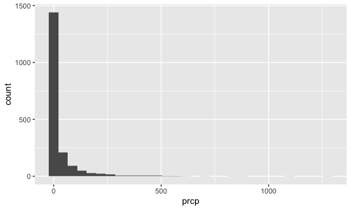
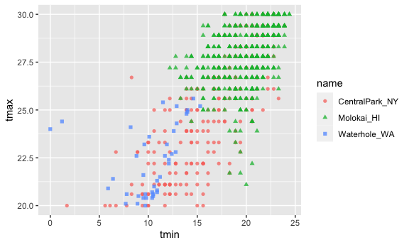
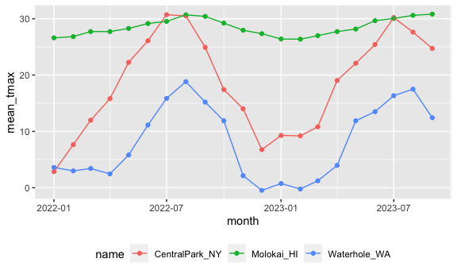
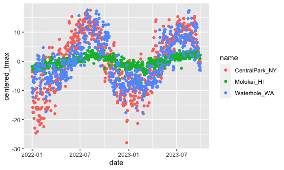

EDA
================

``` r
library(tidyverse)
```

    ## ── Attaching core tidyverse packages ──────────────────────── tidyverse 2.0.0 ──
    ## ✔ dplyr     1.1.3     ✔ readr     2.1.4
    ## ✔ forcats   1.0.0     ✔ stringr   1.5.0
    ## ✔ ggplot2   3.4.3     ✔ tibble    3.2.1
    ## ✔ lubridate 1.9.2     ✔ tidyr     1.3.0
    ## ✔ purrr     1.0.2     
    ## ── Conflicts ────────────────────────────────────────── tidyverse_conflicts() ──
    ## ✖ dplyr::filter() masks stats::filter()
    ## ✖ dplyr::lag()    masks stats::lag()
    ## ℹ Use the conflicted package (<http://conflicted.r-lib.org/>) to force all conflicts to become errors

``` r
library(ggridges)
library(patchwork)

knitr::opts_chunk$set(
  fig.width = 6,
  fig.asp = .6,
  out.width = "90%"
)
```

Get the data for plotting today

``` r
weather_df = 
  rnoaa::meteo_pull_monitors(
    c("USW00094728", "USW00022534", "USS0023B17S"),
    var = c("PRCP", "TMIN", "TMAX"), 
    date_min = "2022-01-01",
    date_max = "2023-12-31") |>
  mutate(
    name = recode(
      id, 
      USW00094728 = "CentralPark_NY", 
      USW00022534 = "Molokai_HI",
      USS0023B17S = "Waterhole_WA"),
    tmin = tmin / 10,
    tmax = tmax / 10,
    month = lubridate::floor_date(date, unit = "month")) |>
  select(name, id, everything())
```

    ## using cached file: /Users/BettyWu/Library/Caches/org.R-project.R/R/rnoaa/noaa_ghcnd/USW00094728.dly

    ## date created (size, mb): 2023-10-01 12:59:26.990129 (8.525)

    ## file min/max dates: 1869-01-01 / 2023-09-30

    ## using cached file: /Users/BettyWu/Library/Caches/org.R-project.R/R/rnoaa/noaa_ghcnd/USW00022534.dly

    ## date created (size, mb): 2023-10-01 12:59:35.20628 (3.83)

    ## file min/max dates: 1949-10-01 / 2023-09-30

    ## using cached file: /Users/BettyWu/Library/Caches/org.R-project.R/R/rnoaa/noaa_ghcnd/USS0023B17S.dly

    ## date created (size, mb): 2023-10-01 12:59:38.078047 (0.994)

    ## file min/max dates: 1999-09-01 / 2023-09-30

``` r
weather_df
```

    ## # A tibble: 1,914 × 7
    ##    name           id          date        prcp  tmax  tmin month     
    ##    <chr>          <chr>       <date>     <dbl> <dbl> <dbl> <date>    
    ##  1 CentralPark_NY USW00094728 2022-01-01   201  13.3  10   2022-01-01
    ##  2 CentralPark_NY USW00094728 2022-01-02    10  15     2.8 2022-01-01
    ##  3 CentralPark_NY USW00094728 2022-01-03     0   2.8  -5.5 2022-01-01
    ##  4 CentralPark_NY USW00094728 2022-01-04     0   1.1  -7.1 2022-01-01
    ##  5 CentralPark_NY USW00094728 2022-01-05    58   8.3  -0.5 2022-01-01
    ##  6 CentralPark_NY USW00094728 2022-01-06     0   5     1.1 2022-01-01
    ##  7 CentralPark_NY USW00094728 2022-01-07    97   1.1  -3.8 2022-01-01
    ##  8 CentralPark_NY USW00094728 2022-01-08     0  -1    -6.6 2022-01-01
    ##  9 CentralPark_NY USW00094728 2022-01-09    25   4.4  -1.6 2022-01-01
    ## 10 CentralPark_NY USW00094728 2022-01-10     0   4.4  -4.3 2022-01-01
    ## # ℹ 1,904 more rows

## Initial numeric work

``` r
weather_df |> 
  ggplot(aes(x = prcp)) + 
  geom_histogram()
```

    ## `stat_bin()` using `bins = 30`. Pick better value with `binwidth`.

    ## Warning: Removed 21 rows containing non-finite values (`stat_bin()`).



here are the big outliers

``` r
weather_df |> 
  filter(prcp >= 1000)
```

    ## # A tibble: 2 × 7
    ##   name       id          date        prcp  tmax  tmin month     
    ##   <chr>      <chr>       <date>     <dbl> <dbl> <dbl> <date>    
    ## 1 Molokai_HI USW00022534 2022-12-18  1120  23.3  18.9 2022-12-01
    ## 2 Molokai_HI USW00022534 2023-01-28  1275  21.7  18.3 2023-01-01

``` r
weather_df |> 
  filter(tmax >= 20, tmax <= 30) |> 
  ggplot(aes(x = tmin, y = tmax, color = name, shape = name)) + 
  geom_point(alpha = .75)
```



## Grouping

``` r
weather_df |>
  group_by(name, month)
```

    ## # A tibble: 1,914 × 7
    ## # Groups:   name, month [63]
    ##    name           id          date        prcp  tmax  tmin month     
    ##    <chr>          <chr>       <date>     <dbl> <dbl> <dbl> <date>    
    ##  1 CentralPark_NY USW00094728 2022-01-01   201  13.3  10   2022-01-01
    ##  2 CentralPark_NY USW00094728 2022-01-02    10  15     2.8 2022-01-01
    ##  3 CentralPark_NY USW00094728 2022-01-03     0   2.8  -5.5 2022-01-01
    ##  4 CentralPark_NY USW00094728 2022-01-04     0   1.1  -7.1 2022-01-01
    ##  5 CentralPark_NY USW00094728 2022-01-05    58   8.3  -0.5 2022-01-01
    ##  6 CentralPark_NY USW00094728 2022-01-06     0   5     1.1 2022-01-01
    ##  7 CentralPark_NY USW00094728 2022-01-07    97   1.1  -3.8 2022-01-01
    ##  8 CentralPark_NY USW00094728 2022-01-08     0  -1    -6.6 2022-01-01
    ##  9 CentralPark_NY USW00094728 2022-01-09    25   4.4  -1.6 2022-01-01
    ## 10 CentralPark_NY USW00094728 2022-01-10     0   4.4  -4.3 2022-01-01
    ## # ℹ 1,904 more rows

``` r
weather_df |>
  group_by(month) |>
  summarize(n_obs = n())
```

    ## # A tibble: 21 × 2
    ##    month      n_obs
    ##    <date>     <int>
    ##  1 2022-01-01    93
    ##  2 2022-02-01    84
    ##  3 2022-03-01    93
    ##  4 2022-04-01    90
    ##  5 2022-05-01    93
    ##  6 2022-06-01    90
    ##  7 2022-07-01    93
    ##  8 2022-08-01    93
    ##  9 2022-09-01    90
    ## 10 2022-10-01    93
    ## # ℹ 11 more rows

``` r
weather_df |>
  group_by(name, month) |>
  summarize(n_obs = n())
```

    ## `summarise()` has grouped output by 'name'. You can override using the
    ## `.groups` argument.

    ## # A tibble: 63 × 3
    ## # Groups:   name [3]
    ##    name           month      n_obs
    ##    <chr>          <date>     <int>
    ##  1 CentralPark_NY 2022-01-01    31
    ##  2 CentralPark_NY 2022-02-01    28
    ##  3 CentralPark_NY 2022-03-01    31
    ##  4 CentralPark_NY 2022-04-01    30
    ##  5 CentralPark_NY 2022-05-01    31
    ##  6 CentralPark_NY 2022-06-01    30
    ##  7 CentralPark_NY 2022-07-01    31
    ##  8 CentralPark_NY 2022-08-01    31
    ##  9 CentralPark_NY 2022-09-01    30
    ## 10 CentralPark_NY 2022-10-01    31
    ## # ℹ 53 more rows

### Counting

``` r
weather_df |>
  count(month, name = "n_obs") 
```

    ## # A tibble: 21 × 2
    ##    month      n_obs
    ##    <date>     <int>
    ##  1 2022-01-01    93
    ##  2 2022-02-01    84
    ##  3 2022-03-01    93
    ##  4 2022-04-01    90
    ##  5 2022-05-01    93
    ##  6 2022-06-01    90
    ##  7 2022-07-01    93
    ##  8 2022-08-01    93
    ##  9 2022-09-01    90
    ## 10 2022-10-01    93
    ## # ℹ 11 more rows

``` r
weather_df |>
  count(name, month) |>
  pivot_wider(
    names_from = name,
    values_from = n
  )
```

    ## # A tibble: 21 × 4
    ##    month      CentralPark_NY Molokai_HI Waterhole_WA
    ##    <date>              <int>      <int>        <int>
    ##  1 2022-01-01             31         31           31
    ##  2 2022-02-01             28         28           28
    ##  3 2022-03-01             31         31           31
    ##  4 2022-04-01             30         30           30
    ##  5 2022-05-01             31         31           31
    ##  6 2022-06-01             30         30           30
    ##  7 2022-07-01             31         31           31
    ##  8 2022-08-01             31         31           31
    ##  9 2022-09-01             30         30           30
    ## 10 2022-10-01             31         31           31
    ## # ℹ 11 more rows

## General summaries

``` r
weather_df |>
  group_by(month) |>
  summarize(
    mean_tmax = mean(tmax, na.rm = TRUE),
    midian_tmax = mean(tmax, na.rm = TRUE),
    n_obs = n(),
    n_days = n_distinct(date))
```

    ## # A tibble: 21 × 5
    ##    month      mean_tmax midian_tmax n_obs n_days
    ##    <date>         <dbl>       <dbl> <int>  <int>
    ##  1 2022-01-01      11.0        11.0    93     31
    ##  2 2022-02-01      12.6        12.6    84     28
    ##  3 2022-03-01      14.4        14.4    93     31
    ##  4 2022-04-01      15.3        15.3    90     30
    ##  5 2022-05-01      18.7        18.7    93     31
    ##  6 2022-06-01      22.1        22.1    90     30
    ##  7 2022-07-01      25.4        25.4    93     31
    ##  8 2022-08-01      27.7        27.7    93     31
    ##  9 2022-09-01      23.5        23.5    90     30
    ## 10 2022-10-01      19.5        19.5    93     31
    ## # ℹ 11 more rows

``` r
weather_df |>
  group_by(name, month) |>
  summarize(mean_tmax = mean(tmax, na.rm = TRUE)) |>
  ggplot(aes(x = month, y = mean_tmax, color = name)) + 
    geom_point() + 
    geom_line() + 
    theme(legend.position = "bottom")
```

    ## `summarise()` has grouped output by 'name'. You can override using the
    ## `.groups` argument.



### kable function and the pivot_wider

``` r
weather_df |>
  group_by(name, month) |>
  summarize(mean_tmax = mean(tmax, na.rm = TRUE)) |> 
  pivot_wider(
    names_from = name,
    values_from = mean_tmax) |> 
  knitr::kable(digits = 1)
```

    ## `summarise()` has grouped output by 'name'. You can override using the
    ## `.groups` argument.

| month      | CentralPark_NY | Molokai_HI | Waterhole_WA |
|:-----------|---------------:|-----------:|-------------:|
| 2022-01-01 |            2.9 |       26.6 |          3.6 |
| 2022-02-01 |            7.7 |       26.8 |          3.0 |
| 2022-03-01 |           12.0 |       27.7 |          3.4 |
| 2022-04-01 |           15.8 |       27.7 |          2.5 |
| 2022-05-01 |           22.3 |       28.3 |          5.8 |
| 2022-06-01 |           26.1 |       29.2 |         11.1 |
| 2022-07-01 |           30.7 |       29.5 |         15.9 |
| 2022-08-01 |           30.5 |       30.7 |         18.8 |
| 2022-09-01 |           24.9 |       30.4 |         15.2 |
| 2022-10-01 |           17.4 |       29.2 |         11.9 |
| 2022-11-01 |           14.0 |       28.0 |          2.1 |
| 2022-12-01 |            6.8 |       27.3 |         -0.5 |
| 2023-01-01 |            9.3 |       26.4 |          0.7 |
| 2023-02-01 |            9.2 |       26.4 |         -0.2 |
| 2023-03-01 |           10.8 |       27.0 |          1.2 |
| 2023-04-01 |           19.0 |       27.7 |          4.0 |
| 2023-05-01 |           22.1 |       28.2 |         11.9 |
| 2023-06-01 |           25.4 |       29.7 |         13.5 |
| 2023-07-01 |           30.2 |       30.0 |         16.3 |
| 2023-08-01 |           27.6 |       30.6 |         17.5 |
| 2023-09-01 |           24.7 |       30.8 |         12.4 |

## Grouped mutate

``` r
weather_df |>
  group_by(name) |>
  mutate(
    mean_tmax = mean(tmax, na.rm = TRUE),
    centered_tmax = tmax - mean_tmax) |> 
  ggplot(aes(x = date, y = centered_tmax, color = name)) + 
    geom_point() 
```

    ## Warning: Removed 21 rows containing missing values (`geom_point()`).



lags: gives yesterday’s data

``` r
weather_df |>
  group_by(name) |>
  mutate(temp_change = tmax - lag(tmax))
```

    ## # A tibble: 1,914 × 8
    ## # Groups:   name [3]
    ##    name           id         date        prcp  tmax  tmin month      temp_change
    ##    <chr>          <chr>      <date>     <dbl> <dbl> <dbl> <date>           <dbl>
    ##  1 CentralPark_NY USW000947… 2022-01-01   201  13.3  10   2022-01-01        NA  
    ##  2 CentralPark_NY USW000947… 2022-01-02    10  15     2.8 2022-01-01         1.7
    ##  3 CentralPark_NY USW000947… 2022-01-03     0   2.8  -5.5 2022-01-01       -12.2
    ##  4 CentralPark_NY USW000947… 2022-01-04     0   1.1  -7.1 2022-01-01        -1.7
    ##  5 CentralPark_NY USW000947… 2022-01-05    58   8.3  -0.5 2022-01-01         7.2
    ##  6 CentralPark_NY USW000947… 2022-01-06     0   5     1.1 2022-01-01        -3.3
    ##  7 CentralPark_NY USW000947… 2022-01-07    97   1.1  -3.8 2022-01-01        -3.9
    ##  8 CentralPark_NY USW000947… 2022-01-08     0  -1    -6.6 2022-01-01        -2.1
    ##  9 CentralPark_NY USW000947… 2022-01-09    25   4.4  -1.6 2022-01-01         5.4
    ## 10 CentralPark_NY USW000947… 2022-01-10     0   4.4  -4.3 2022-01-01         0  
    ## # ℹ 1,904 more rows

``` r
weather_df |>
  group_by(name) |>
  mutate(temp_change = tmax - lag(tmax)) |>
  summarize(
    temp_change_sd = sd(temp_change, na.rm = TRUE),
    temp_change_max = max(temp_change, na.rm = TRUE))
```

    ## # A tibble: 3 × 3
    ##   name           temp_change_sd temp_change_max
    ##   <chr>                   <dbl>           <dbl>
    ## 1 CentralPark_NY           4.39            12.8
    ## 2 Molokai_HI               1.20             6.1
    ## 3 Waterhole_WA             3.13            11.1
